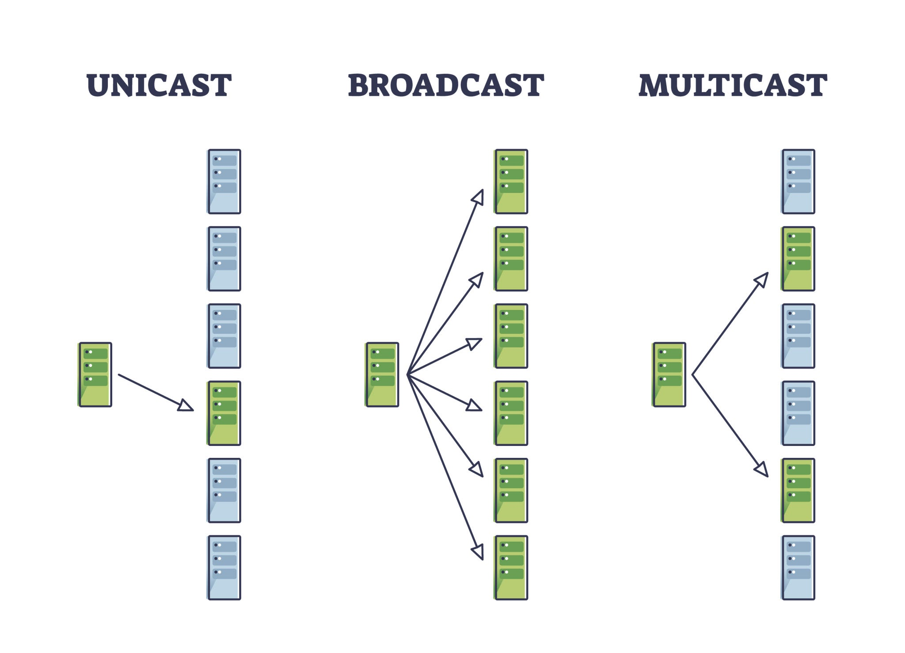

# Comprehensive RCA Architecture Guide

**Project Stressed: Automated Root Cause Analysis Pipeline**  
*Date: December 4, 2025*

---

## Table of Contents
1. [Overview](#overview)
2. [Phase 3: Vectorization](#phase-3-vectorization-the-vocabulary)
3. [Phase 4: Neural Network Training](#phase-4-the-neural-network-training)
4. [Phase 5: RCA Reporting](#phase-5-the-rca-reporter-actionable-insights)
5. [Production Considerations](#production-considerations)
6. [Conclusion](#conclusion-for-leadership)

---

## Overview

This document serves as the primary architectural blueprint for Project Stressed, a comprehensive technical solution designed for Senior Architects to understand the theory and strategy behind automated root cause analysis.

### Labeling Strategy (The Supervisor)

**Objective:** Teach the AI what "Success" looks like.

**Rules:**
- **Success:** If the sequence contains `Screen_S14` → Label = `1`
- **Failure:** Otherwise → Label = `0`

---

## Phase 3: Vectorization (The Vocabulary)

**Objective:** Translate words into math.

### Process

1. **Build the Dictionary**
   - Scan 24 hours of logs to identify every unique Event Name
   - Create mapping: `{"UseCase_Login": 1, "UseCase_Auth": 2, ...}`

2. **Tokenization**
   - Convert session lists into integer sequences
   - Example: `['UseCase_Login', 'UseCase_Auth']` → `[1, 2]`

3. **Handle Unknown Events**
   - Map unknown events to special `<UNK>` token
   - Prevents model crashes on new/unexpected errors

---

## Phase 4: The Neural Network (Training)

**Objective:** Train the LSTM to recognize the "Shape" of a valid order.

### Model Topology (PyTorch)

| Layer | Type | Dimension | Purpose |
|-------|------|-----------|---------|
| **Input** | Sequence | Length 20 | Integer sequence of events |
| **Layer 1** | Embedding | Dimension 16 | Maps Event ID → 16-float vector |
| **Layer 2** | LSTM | Hidden 32 | Memory capacity for sequence patterns |
| **Layer 3** | Linear | Output 1 | Probability score (0-1) |

### Training Loop

- Feed the model labeled sequences:
  - **10,000 "Success" sequences** (complete order flows)
  - **2,000 "Failure" sequences** (incomplete/broken flows)
  
- **Learning Outcome:**
  - The model learns that `[1, 2, 3, 8]` indicates success
  - Sequences like `[1, 2]` (stopping early) indicate failure

---

## Phase 5: The RCA Reporter (Actionable Insights)

**Objective:** Provide actionable explanations for failures.

### "Last Gasp" Analysis

For every failed order, identify the **Last Successful Step**.

**Example:**
- **Sequence:** `[Login, Auth, Dashboard, CheckDelivery]` → stops
- **Insight:** Failure occurred during or after `CheckDelivery`

### Intelligent Clustering

**Don't report 1,000 failures individually—group them strategically:**

- **Cluster A:** 400 orders failed at `UseCase_CheckDelivery`  
  → *Likely Logistics API outage*
  
- **Cluster B:** 50 orders failed at `UseCase_Auth`  
  → *Likely specific user data issue*

---

## Production Considerations

### Hardware & Throughput

**The Bottleneck:** LLM Parsing (Stage 1) is the most compute-intensive operation.

**Optimization Strategy:**
- Don't parse every log line
- Use lightweight filter to discard "Heartbeat" or "Debug" noise
- Only pass "Transaction" logs to the LLM

**Performance Estimate:**
- A 4090 GPU can parse ~50-100 log lines/second with a quantized 7B model
- For 24h of logs, parallel batching is required

### Scalability

**Containerization:**
- Dockerize the Python environment (`torch`, `outlines`, `pandas`)
- Enables deployment on any GPU node

**Persistent Storage:**
- Store "Learned Vocabulary" (JSON file)
- Store "Trained Model" (`.pth` file)
- **Retraining Schedule:** Weekly (not daily)

---

## Conclusion for Leadership

This architecture enables a paradigm shift:

### From Reactive to Proactive
- **Before:** Reactive Firefighting (searching logs after customer complaints)
- **After:** Proactive Intelligence (automated morning reports on root causes)

### The Power of Hybrid AI
By combining:
- **LLM Flexibility** → Handles messy legacy logs without thousands of regex rules
- **LSTM Reliability** → Understands strict business process flows

We create a **robust observer** that understands business rules automatically, reducing manual intervention and accelerating incident resolution.

---

**Architecture Status:** ✅ Production Ready  
**Next Steps:** GPU deployment and integration with monitoring systems