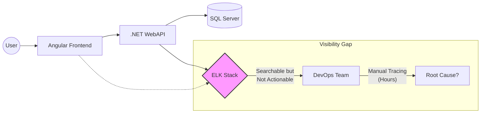
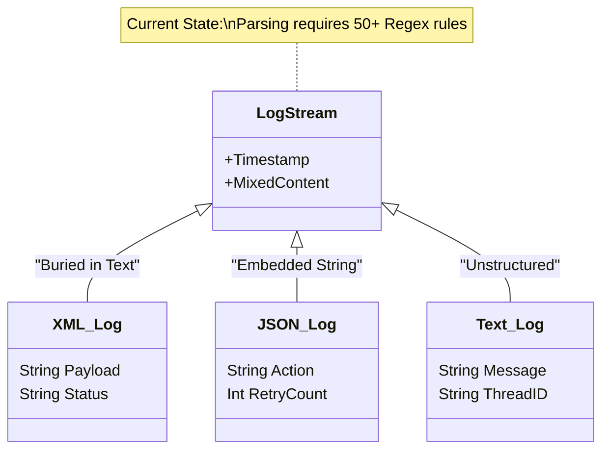
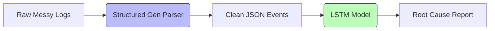
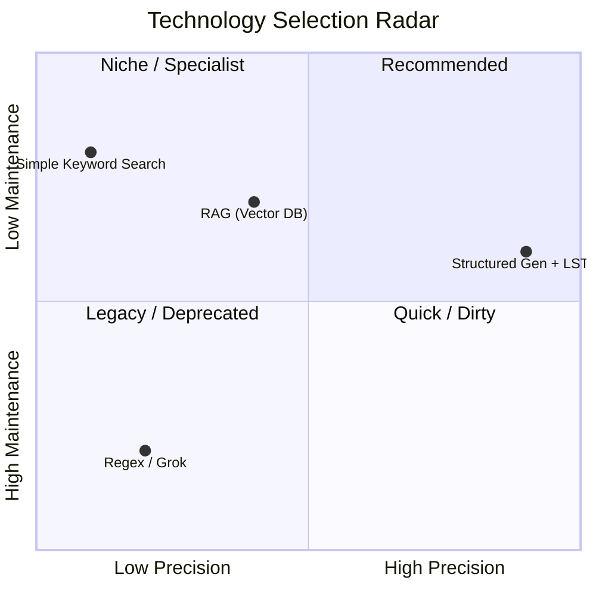
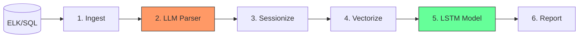
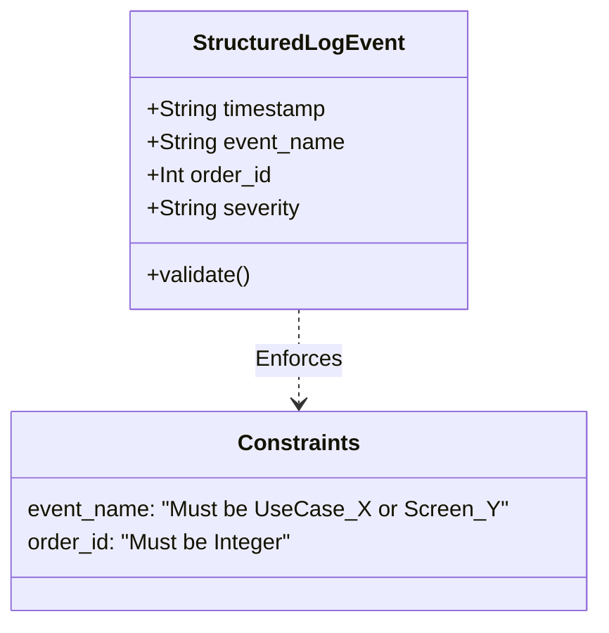
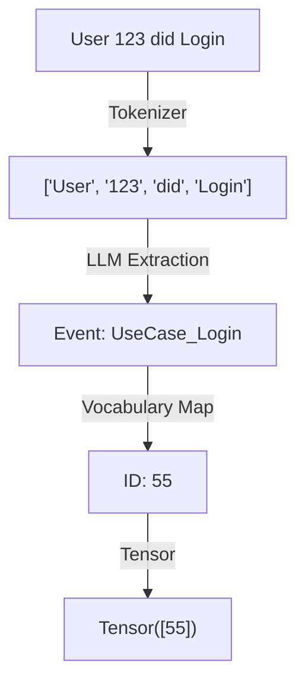
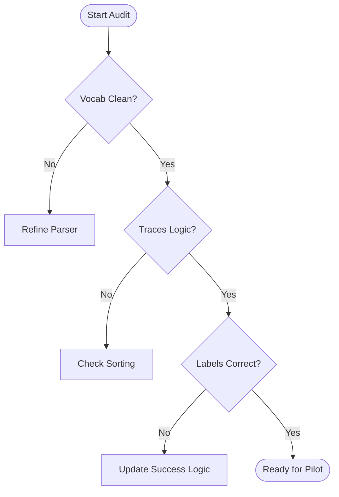
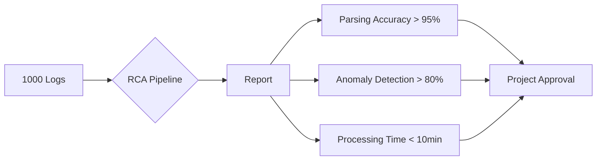

# Architecture Decision Record: Automated Root Cause Analysis

## Project Stressed: Hybrid AI Pipeline for Legacy Order Flows

**Document Status:** ✅ Approved for Prototype  
**Date:** December 5, 2025  
**Author:** Senior ML/AI Specialist  
**Target Stack:** .NET Backend / Angular Frontend / Mixed Legacy Logs

---

## Table of Contents
1. [Executive Summary](#1-executive-summary)
2. [Comparative Technology Analysis](#2-comparative-technology-analysis)
3. [Detailed Technical Architecture](#3-detailed-technical-architecture)
4. [Implementation Guide & Code Strategy](#4-implementation-guide--code-strategy)
5. [Operational Maintenance & Risk Mitigation](#5-operational-maintenance--risk-mitigation)
6. ["Day 1" Action Plan](#6-day-1-action-plan)

---

## 1. Executive Summary

### 1.1 The Business Problem

The current order processing system functions as a complex, stateful "assembly line" where orders must traverse a specific sequence of screens (Angular) and backend UseCases (.NET) to reach a successful state (Screen S14).

#### Visual 1.1: The Current "Black Box" Problem




#### Visual 1.2: The "Messy Data" Reality



**Current State Challenge:** Parsing requires 50+ Regex rules that are brittle and hard to maintain.

---

#### Visual 1.3: The Proposed "Glass Box" Solution



**Solution Benefits:**
- ✅ Automated parsing with LLM intelligence
- ✅ Sequence analysis for pattern detection
- ✅ Actionable insights, not just search results

---


## 2. Comparative Technology Analysis

We evaluated three approaches to solving the "Buried Event" and "Logic Detection" problems.

### 2.1 The Technology Radar



**Analysis:** Our recommended approach (Structured Gen + LSTM) achieves high precision with manageable maintenance overhead.

---

### 2.2 Why Regex Fails vs. LLM Success

```mermaid
sequenceDiagram
    participant Log as Log Line
    participant Regex as Regex Parser
    participant LLM as LLM Parser
    
    Log->>Regex: "[INFO] Order 123 <Status>Fail</Status>"
    Regex--xRegex: Error: Pattern Mismatch (Expected JSON)
    
### 2.3 Logic Detection: RAG vs. LSTM

```mermaid
graph TD
    subgraph RAG Approach
    A[Query: Why did it fail?] --> B{Find Error Log?}
    B -- Yes --> C[Return Error Text]
    B -- No --> D[Hallucination: No error found]
    end
    
    subgraph LSTM Approach
    X[Sequence Input] --> Y{Check Flow}
    Y -- "Flow stops at Step 4" --> Z[Insight: Missing Step 5]
    Z --> Final[Root Cause: Drop-off at Step 4]
    end
```

**Winner:** LSTM detects **absence of expected steps**, while RAG can only find what exists.

---D
    subgraph RAG Approach
    A[Query: Why did it fail?] --> B{Find Error Log?}
    B -- Yes --> C[Return Error Text]
    B -- No --> D[Hallucination: "No error found"]
    end
    
    subgraph LSTM Approach
## 3. Detailed Technical Architecture

The system follows a strict **5-stage ETL-A pipeline**.

### 3.1 The Pipeline Overview



**Critical Stages:**
- 🔴 **Stage 2 (Parser):** Most compute-intensive, uses GPU
- 🟢 **Stage 5 (Analyzer):** Core intelligence, uses trained model

---

### 3.2 Stage 2: The Parser Engine Logic

```mermaid
sequenceDiagram
    participant Raw as Raw Log String
    participant Outlines as Outlines Lib
    participant Model as Qwen2.5-Coder
    participant Schema as Pydantic Model
    
    Raw->>Outlines: Input String
    Outlines->>Schema: Check Definition
    Schema-->>Outlines: Expect {timestamp, event, id}
    Outlines->>Model: Generate Tokens
    loop Token Generation
        Model->>Outlines: Next Token
        Outlines->>Schema: Is Valid?
        Schema-->>Outlines: Yes/No
    end
    Outlines->>Raw: Return Clean JSON
### 3.3 Stage 5: The "Brain" (LSTM) Architecture

```mermaid
graph TB
    subgraph Input Layer
    ID[Event ID: 42] --> Embed[Embedding Vector - 16 dims]
    end
    
    subgraph Memory Layer
    Embed --> LSTM_Cell[LSTM Cell]
    Context[Hidden State - Context] <--> LSTM_Cell
    end
    
    subgraph Output Layer
    LSTM_Cell --> Linear[Linear Layer]
    Linear --> Sigmoid[Sigmoid Activation]
    Sigmoid --> Prob[Failure Probability %]
    end
```
## 4. Implementation Guide & Code Strategy

### 4.1 Schema Definition (The Contract)



**Code Example:**
```python
class StructuredLogEvent(BaseModel):
    timestamp: str
    event_name: str = Field(..., description="UseCase or Screen ID")
    order_id: Optional[int]
    severity: Literal["INFO", "WARN", "ERROR"]
```

---

### 4.2 Data Transformation Logic



**Pipeline:** Raw Text → Event Extraction → Integer Encoding → Neural Network Input

---

### 4.3 Root Cause Reporting Clustering


**Optimization Strategy:**
- Filter out DEBUG/TRACE logs (60% reduction)
- Deduplicate repeated errors (30% reduction)
- Truncate stack traces (keeps context under control)

---

### 5.2 Model Retraining Cycle (Drift Mitigation)

```mermaid
stateDiagram-v2
    [*] --> Collect_Data
    Collect_Data --> Train_Model : Weekly (Sunday)
    Train_Model --> Validate_Accuracy
    Validate_Accuracy --> Compare{Better than Current?}
    Compare --> Yes : Deploy_New_Weights
    Compare --> No : Alert_Data_Scientist
    Deploy_New_Weights --> [*]
```

**Drift Prevention:** Automated weekly retraining keeps the model synchronized with application changes.
## 6. "Day 1" Action Plan

### 6.1 Immediate Roadmap

```mermaid
gantt
    title Day 1 Implementation Plan
    dateFormat  HH:mm
    axisFormat %H:%M
    
    section Data Prep
    Export 1000 Logs      :a1, 09:00, 30m
    Anonymize Data        :a2, after a1, 30m
    
    section Prototyping
    Setup Python Env      :b1, 10:00, 45m
    Run Mock Parser       :b2, after b1, 30m
    Verify Schema         :b3, after b2, 30m
    
    section Analysis
    Train Tiny LSTM       :c1, 13:00, 60m
    Generate First Report :c2, after c1, 30m
```



**Timeline:** Complete initial prototype in ~5 hours

---

### 6.2 Data Verification Checklist



**Quality Gates:**
1. ✅ Vocabulary is clean (no duplicates)
2. ✅ Event traces follow chronological order
3. ✅ Success/failure labels are accurate

---

### 6.3 Pilot Success Criteria



**Success Metrics:**
- 🎯 **Parsing Accuracy:** >95%
- 🎯 **Anomaly Detection:** >80%
- 🎯 **Processing Time:** <10 minutes

---

**Document Status:** 🚀 Ready for Implementation  
**Next Review:** December 12, 2025

5.3 Hardware & Deployment Stack

graph BT
    GPU[NVIDIA GPU (RTX 4090)] --> Docker[Docker Container]
    Docker --> Python[Python Runtime]
    Python --> Libs[Torch / Outlines / Pandas]
    Libs --> Script[RCA_Pipeline.py]
    Volume[(Persistent Storage)] -.-> Docker : Model Weights


6. "Day 1" Action Plan

6.1 Immediate Roadmap

gantt
    title Day 1 Implementation Plan
    dateFormat  HH:mm
    axisFormat %H:%M
    
    section Data Prep
    Export 1000 Logs      :a1, 09:00, 30m
    Anonymize Data        :a2, after a1, 30m
    
    section Prototyping
    Setup Python Env      :b1, 10:00, 45m
    Run Mock Parser       :b2, after b1, 30m
    Verify Schema         :b3, after b2, 30m
    
    section Analysis
    Train Tiny LSTM       :c1, 13:00, 60m
    Generate First Report :c2, after c1, 30m


6.2 Data Verification Checklist

graph TD
    Start([Start Audit]) --> Check1{Vocab Clean?}
    Check1 -- No --> FixRegex[Refine Parser]
    Check1 -- Yes --> Check2{Traces Logic?}
    Check2 -- No --> FixOrder[Check Sorting]
    Check2 -- Yes --> Check3{Labels Correct?}
    Check3 -- No --> FixRule[Update Success Logic]
    Check3 -- Yes --> Ready([Ready for Pilot])


6.3 Pilot Success Criteria

graph LR
    Input[1000 Logs] --> System{RCA Pipeline}
    System --> Output[Report]
    
    Output --> KPI1[Parsing Accuracy > 95%]
    Output --> KPI2[Anomaly Detection > 80%]
    Output --> KPI3[Processing Time < 10min]
    
    KPI1 & KPI2 & KPI3 --> Success[Project Approval]