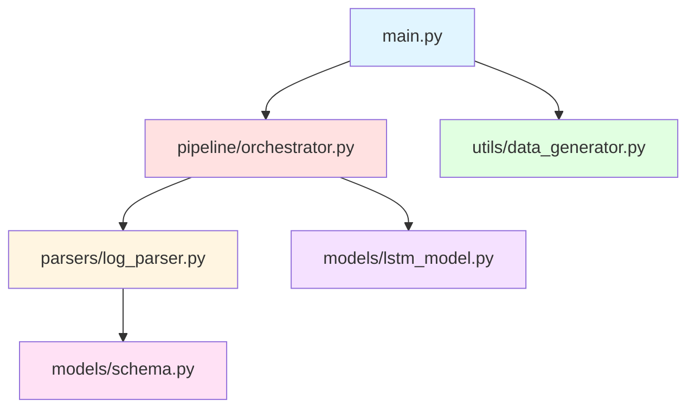

# Project Structure Diagram

## Directory Tree

```
Stressed Pipeline/
│
├── 📄 main.py                    # Entry point - runs the complete pipeline
├── 📄 stressed.py                # Original monolithic version (preserved)
├── 📄 requirements.txt           # Python dependencies
├── 📄 README.md                  # Project documentation
│
├── 📁 models/                    # Data Models & Neural Networks
│   ├── __init__.py              # Package initialization
│   ├── schema.py                # Pydantic schema (StructuredLogEvent)
│   └── lstm_model.py            # LSTM neural network (RCA_LSTM)
│
├── 📁 parsers/                   # Log Parsing Components
│   ├── __init__.py              # Package initialization
│   └── log_parser.py            # LogParserAgent class
│
├── 📁 utils/                     # Utility Functions
│   ├── __init__.py              # Package initialization
│   └── data_generator.py        # Synthetic log generator
│
└── 📁 pipeline/                  # Pipeline Orchestration
    ├── __init__.py              # Package initialization
    └── orchestrator.py          # ProjectStressedPipeline class
```

## Module Dependencies



## Data Flow


## Component Responsibilities

### 🎯 main.py
- Entry point for execution
- Sets random seeds for reproducibility
- Orchestrates the complete pipeline flow

### 🏭 pipeline/orchestrator.py
**Class:** `ProjectStressedPipeline`
- Coordinates all pipeline stages
- Manages vocabulary (event_to_id mapping)
- Implements ETL, sessionization, vectorization
- Trains the LSTM model
- Generates detailed reports

### 🧠 models/lstm_model.py
**Class:** `RCA_LSTM`
- PyTorch LSTM implementation
- Embedding layer (16 dims)
- LSTM layer (hidden 32)
- Binary classification output

### 📋 models/schema.py
**Class:** `StructuredLogEvent`
- Pydantic model for strict typing
- Fields: timestamp, event_name, order_id, severity, details

### 🔍 parsers/log_parser.py
**Class:** `LogParserAgent`
- Parses messy logs using regex
- Extracts structured data
- Returns StructuredLogEvent objects

### 🎲 utils/data_generator.py
**Function:** `generate_messy_logs()`
- Simulates legacy .NET/Angular logs
- Mixes Text, XML, and JSON formats
- Generates success/failure scenarios

## Execution Flow

```
1. main.py initializes the pipeline
   ↓
2. Generates synthetic messy logs
   ↓
3. orchestrator.run_etl() parses raw logs
   ↓
4. orchestrator.sessionize_data() groups by Order ID
   ↓
5. orchestrator.prepare_vectors() builds vocabulary
   ↓
6. orchestrator.train_model() trains LSTM
   ↓
7. Generate three reports:
   - System internals (vocabulary)
   - Order deep dive (trace)
   - Root cause analysis (aggregated insights)
```

## Key Benefits of Modular Structure

✅ **Maintainability**: Each component has a single responsibility  
✅ **Testability**: Individual modules can be tested in isolation  
✅ **Reusability**: Components can be imported and used independently  
✅ **Scalability**: Easy to extend with new parsers or models  
✅ **Clarity**: Clear separation of concerns  

## Migration Notes

- Original `stressed.py` is preserved for reference
- All functionality remains identical
- New structure follows Python best practices
- Added comprehensive docstrings
- Improved import organization
